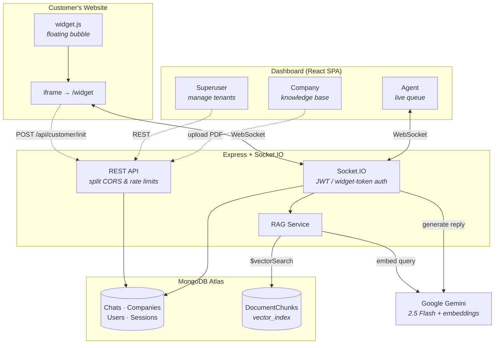
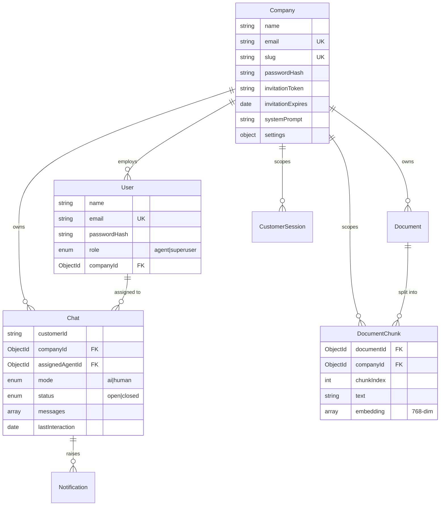

<div align="center">

# SupportCue

**AI customer support that actually knows your product.**

Companies upload their documentation, and an embeddable chat widget answers customer
questions grounded in it — handing off to a human agent the moment the AI can't help.

[](https://nodejs.org)
[](https://react.dev)
[](https://www.mongodb.com/atlas)
[](https://socket.io)
[](https://ai.google.dev)
[](LICENSE)

</div>

---

## Table of Contents

- [Overview](#overview)
- [Architecture](#architecture)
- [How the RAG Pipeline Works](#how-the-rag-pipeline-works)
- [Authentication Model](#authentication-model)
- [Quick Start](#quick-start)
- [Environment Variables](#environment-variables)
- [MongoDB Atlas Vector Search](#mongodb-atlas-vector-search)
- [Embedding the Widget](#embedding-the-widget)
- [API Reference](#api-reference)
- [Socket.IO Events](#socketio-events)
- [Data Model](#data-model)
- [Project Structure](#project-structure)
- [Deployment](#deployment)
- [Security Notes](#security-notes)
- [Known Limitations](#known-limitations)
- [License](#license)

---

## Overview

SupportCue is a multi-tenant support platform built around three ideas:

**Answers come from your documents, not the model's imagination.** Uploaded PDFs are chunked, embedded, and retrieved at query time. The retrieved passages are injected into the system prompt with an explicit instruction to escalate rather than guess when the documents don't cover the question.

**Escalation is a first-class path, not an error state.** The AI returns structured JSON on every turn — `{ answer, handoff_requested }` — so a handoff is a normal, expected outcome. It fires when a customer asks for a human, expresses frustration, the knowledge base comes up empty, or the Gemini call fails outright.

**Tenancy is enforced at the query layer.** Every document, chunk, chat, and session carries a `companyId`, and retrieval filters on it inside the vector search itself — so one tenant's documents can never surface in another tenant's conversation.

### Feature Highlights

| | |
|---|---|
| **RAG-grounded replies** | PDFs → chunks → 768-dim Gemini embeddings → Atlas Vector Search, with a cosine-similarity fallback when Atlas vector search is unavailable |
| **Live human handoff** | Agents watch conversations in real time and take over mid-thread; the customer sees a system message naming their agent |
| **Embeddable widget** | One config object plus one `<script>` tag; renders in a sandboxed iframe that resizes via origin-checked `postMessage` |
| **Per-company AI persona** | Each company sets its own `systemPrompt`; the handoff contract is appended automatically so persona edits can't break routing |
| **Three-tier auth** | Separate identities and signing secrets for staff, companies, and anonymous widget customers |
| **Split CORS + rate limits** | Widget routes are open-origin at 60 req/min; dashboard routes are allowlist-only at 50 req/15 min |
| **Email notifications** | Company invitation and onboarding flow over SMTP |

---

## Architecture



### Socket Rooms

Messages are routed through three room types:

| Room | Members | Purpose |
|---|---|---|
| `<chatId>` | Customer + assigned agent | Message delivery, typing, AI indicators |
| `agents_<companyId>` | That company's agents | Queue updates, escalation alerts |
| `superusers` | All superusers | Global oversight across every tenant |

---

## How the RAG Pipeline Works

### Ingestion — `POST /api/kb/upload`

```
PDF (≤10 MB)
  → pdf-parse text extraction
  → chunk: ~500 tokens (2000 chars), 50-token (200-char) overlap,
           snapped to sentence boundaries, fragments <50 chars dropped
  → embed: gemini-embedding-2, 768 dimensions, ~8 calls/sec
  → store: DocumentChunk documents, batched 10 at a time
  → delete source PDF from disk
```

Chunks are embedded and persisted **in batches of 10**, with each batch released before the next is fetched. Memory stays flat regardless of document size, so a 500-page PDF costs roughly the same headroom as a 5-page one. Documents move through `processing → ready`, or land in `error` with the failure message stored on the record. Re-uploading replaces prior chunks rather than duplicating them, and the temp file is removed on both the success and failure paths.

### Retrieval — on every customer message

```
customer message
  → embed query (768-dim)
  → $vectorSearch on vector_index, filtered to companyId
     numCandidates = 50, limit = 5
  → drop results scoring below 0.45
  → inject surviving passages into the system prompt
  → Gemini 2.5 Flash → { answer, handoff_requested }
```

If Atlas vector search is unavailable, the service falls back to loading chunks for the company and scoring cosine similarity in-process — **capped at 500 chunks** to bound memory, and logged loudly in production. This is a development convenience, not a scaling strategy; see [Vector Search setup](#mongodb-atlas-vector-search).

### Generation parameters

| Setting | Value |
|---|---|
| Model | `gemini-2.5-flash` |
| Temperature | `0.6` |
| Max output tokens | `150`, raised to `400` when RAG context is present |
| Response format | `application/json` (structured output) |
| Request timeout | 15s, then fallback reply with `handoff_requested: true` |
| Per-chat cooldown | 300 ms |
| History window | Last 15 messages |

The Gemini API rejects histories that don't open on a `user` turn and merges poorly on consecutive same-role turns, so `buildContentsArray` collapses adjacent same-role messages and prepends a synthetic `[Customer joined the chat]` turn when history starts with an AI greeting.

---

## Authentication Model

Three distinct identities, two signing secrets:

| Identity | Issued by | Signed with | Claims | Lifetime |
|---|---|---|---|---|
| **Staff** (agent / superuser) | `POST /api/auth/login` | `JWT_SECRET` | `userId` | Session |
| **Company** | `POST /api/auth/company/login` | `JWT_SECRET` | `companyId` | Session |
| **Widget customer** | `POST /api/customer/init` | `WIDGET_SECRET` | `customerId`, `companyId`, `type: "widget"` | 24 h |

A company token authenticates the *organization*, not a person — it gates knowledge-base management and chat history. Staff tokens gate the live queue and takeover. The two are distinguished by which claim is present, so a company token cannot satisfy a staff-only route and vice versa.

Socket.IO enforces the same split during the handshake: customers present `{ token, role: 'customer' }` verified against `WIDGET_SECRET` with a required `type: 'widget'` claim; staff present a JWT verified against `JWT_SECRET`. **Unauthenticated sockets are rejected at the middleware layer**, before any handler runs. Message handlers additionally verify that the claimed `senderId` matches the authenticated socket identity, so a client cannot impersonate another participant by forging the payload.

Middleware: `auth` · `optionalAuth` · `requireAgent` · `requireSuperuser` · `companyAuth`

---

## Quick Start

### Prerequisites

- **Node.js 18+**
- **MongoDB** — Atlas strongly recommended (required for vector search)
- **Google Gemini API key** — [get one free](https://aistudio.google.com/app/apikey)

### 1. Backend

```bash
cd backend
npm install
cp env.example .env      # then edit .env with your values
npm run dev              # nodemon on http://localhost:5000
```

### 2. Frontend

```bash
cd frontend
npm install
cp .env.example .env     # then edit .env with your values
npm run dev              # Vite on http://localhost:3000
```

Vite proxies `/api` to `http://localhost:5000`, so the dashboard works without CORS configuration in development.

### 3. Seed a superuser

```bash
cd backend
npm run seed:superuser
```

> [!WARNING]
> `src/scripts/seedSuperuser.js` contains hardcoded default credentials. **Change them before running the script**, and rotate immediately after first login. Never run this against production with the defaults in place.

### 4. First run

1. Sign in at `http://localhost:3000/login` as the superuser.
2. Create a company — this generates an invitation token and emails an onboarding link.
3. Complete company setup to set the company password and AI persona.
4. Sign in as the company, upload a PDF, and wait for status `ready`.
5. Test retrieval with `GET /api/kb/search?q=...`, or open the widget and ask a question.

### 5. Verify

```bash
curl http://localhost:5000/health
# {"status":"OK","timestamp":"...","environment":"development"}
```

---

## Environment Variables

### Backend — `backend/.env`

| Variable | Required | Default | Description |
|---|:---:|---|---|
| `PORT` | | `5000` | HTTP listen port |
| `NODE_ENV` | | `development` | `production` enables static SPA serving |
| `MONGO_URI` | ✅ | `mongodb://localhost:27017/support_platform` | MongoDB connection string |
| `JWT_SECRET` | ✅ | *insecure dev fallback* | Signs staff and company tokens |
| `WIDGET_SECRET` | ✅ | falls back to `JWT_SECRET` | Signs widget session tokens |
| `GEMINI_API_KEY` | ✅ | — | Powers both chat and embeddings |
| `CORS_ORIGIN` | | `http://localhost:3000,http://localhost:5173` | Comma-separated dashboard origin allowlist |
| `FRONTEND_URL` | | `http://localhost:3000` | Base URL used in invitation emails |
| `SMTP_USER` | | — | SMTP username for outbound email |
| `SMTP_PASS` | | — | SMTP password or app-specific password |

> [!CAUTION]
> `JWT_SECRET` and `WIDGET_SECRET` have **insecure hardcoded fallbacks** so the app can boot without configuration. The server warns on startup when they're missing, but it does not refuse to start. Always set both explicitly before deploying — anyone who knows the fallback values can mint valid tokens.

### Frontend — `frontend/.env`

| Variable | Required | Description |
|---|:---:|---|
| `VITE_SOCKET_URL` | ✅ | Backend base URL, no trailing slash |

### Generating secrets

```bash
node -e "console.log(require('crypto').randomBytes(64).toString('hex'))"
```

---

## MongoDB Atlas Vector Search

Create a **Vector Search index** named `vector_index` on the `documentchunks` collection:

```json
{
  "fields": [
    {
      "type": "vector",
      "path": "embedding",
      "numDimensions": 768,
      "similarity": "cosine"
    },
    {
      "type": "filter",
      "path": "companyId"
    }
  ]
}
```

The `companyId` filter field is **not optional** — it is what enforces tenant isolation inside the search itself. Without it the `$vectorSearch` stage fails and the app silently degrades to the 500-chunk in-memory fallback, which is both slower and unable to see your full corpus.

---

## Embedding the Widget

Add to any page on the customer's site:

```html
<script>
  window.SupportCueConfig = {
    companyId: "YOUR_COMPANY_ID",
    serverUrl: "https://your-deployment.example.com"
  };
</script>
<script src="https://your-deployment.example.com/widget.js" async></script>
```

| Option | Required | Description |
|---|:---:|---|
| `companyId` | ✅ | MongoDB `_id` of the company; scopes the knowledge base and agent routing |
| `serverUrl` | ✅ | Backend base URL; trailing slash is stripped automatically |
| `customerId` | | Your own stable user identifier. Supply it to persist conversation history across sessions and devices; omit it and a per-browser identity is generated. |

**How it renders.** The script injects a fixed-position container and an iframe pointing at `/widget` on the origin the script was served from, starting collapsed at 64×64. The embedded app drives expansion by posting `{ source: 'supportcue-widget', type: 'resize' }` back to the parent, which is accepted **only** when `event.origin` matches the script origin. Running the chat inside an iframe keeps host-page CSS and scripts fully isolated from the widget — and the widget's DOM out of reach of the host page. The script is idempotent: loading it twice is a no-op.

> [!NOTE]
> Serve `widget.js` from the same origin that serves the SPA. In a single-origin production deploy (`NODE_ENV=production`, backend serving `frontend/dist`) that's simply your backend domain. In a split deploy, load it from the frontend origin — otherwise the derived iframe URL won't resolve.

---

## API Reference

Base URL: `/api` · Authenticated requests use `Authorization: Bearer <token>`

### Auth — `/api/auth`

| Method | Endpoint | Auth | Description |
|---|---|---|---|
| `POST` | `/register` | Public | Register a staff user |
| `POST` | `/login` | Public | Staff login → JWT |
| `POST` | `/company/login` | Public | Company login → company JWT |
| `GET` | `/company/verify-invite` | Public | Validate an invitation token |
| `POST` | `/company/accept-invite` | Public | Set company password, consume invite |
| `GET` | `/profile` | Staff | Current user profile |
| `POST` | `/logout` | Staff | Invalidate session |

### Chat — `/api/chat`

| Method | Endpoint | Auth | Description |
|---|---|---|---|
| `POST` | `/create` | Public | Create a chat (widget entry point) |
| `GET` | `/user-chats` | Optional | Chats for the current customer |
| `GET` | `/company/history` | Company | Full conversation history |
| `GET` | `/active` | Agent | Live queue |
| `POST` | `/takeover` | Agent | Claim a chat → `mode: 'human'` |
| `PUT` | `/:chatId/close` | Agent | Close a conversation |
| `GET` | `/:chatId` | Optional | Fetch a single chat |

### Knowledge Base — `/api/kb`

| Method | Endpoint | Auth | Description |
|---|---|---|---|
| `POST` | `/upload` | Company | Upload a PDF (`multipart/form-data`, field `document`, ≤10 MB, PDF only) |
| `GET` | `/documents` | Company | List documents with processing status |
| `GET` | `/document/:docId` | Company | Document detail |
| `DELETE` | `/document/:docId` | Company | Delete document and its chunks |
| `GET` | `/search` | Company | Test retrieval without running a chat |

### Companies — `/api/company` *(superuser only)*

| Method | Endpoint | Description |
|---|---|---|
| `POST` | `/` | Create company, generate invite, send onboarding email |
| `GET` | `/` | List all companies |
| `POST` | `/assign-user` | Assign an agent to a company |
| `GET` | `/:id` | Company detail |
| `PUT` | `/:id` | Update company settings and AI persona |
| `DELETE` | `/:id` | Delete a company |

### Customer Sessions — `/api/customer`

| Method | Endpoint | Auth | Description |
|---|---|---|---|
| `POST` | `/init` | Public | Create/resume a session → 24 h widget token |
| `PUT` | `/set-company` | Agent | Reassign a customer session to a company |

### Notifications — `/api/notifications`

| Method | Endpoint | Auth | Description |
|---|---|---|---|
| `GET` | `/?unreadOnly=true` | Agent · Superuser | List notifications |
| `PUT` | `/read-all` | Agent · Superuser | Mark all read |
| `PUT` | `/:id/read` | Agent · Superuser | Mark one read |
| `DELETE` | `/:id` | Agent · Superuser | Delete notification |

### Health

| Method | Endpoint | Description |
|---|---|---|
| `GET` | `/health` | Liveness probe — status, timestamp, environment |

### Rate Limits

| Scope | Window | Max | Applies to |
|---|---|---|---|
| Widget | 1 min | 60 / IP | `/api/customer`, `/api/chat` |
| Dashboard | 15 min | 50 / IP | `/api/auth`, `/api/company`, `/api/kb`, `/api/notifications` |

`trust proxy` is enabled, so limits key off the real client IP behind a reverse proxy rather than the proxy's own address.

---

## Socket.IO Events

Handshake auth: `{ token, role }` where role is `customer`, `agent`, or `superuser`.

### Client → Server

| Event | Payload | Description |
|---|---|---|
| `joinChat` | `{ chatId, userId }` | Join a room; replies with `chatHistory`. Customers are verified against chat ownership. |
| `leaveChat` | `{ chatId, userId }` | Leave a room |
| `joinAgents` | `{ userId }` | Join `agents_<companyId>` or `superusers`; rejected for customers |
| `sendMessage` | `{ chatId, senderId, senderRole, text }` | Send a message; triggers the AI turn when `mode === 'ai'` |
| `typing` | `{ chatId, userId, isTyping }` | Broadcast typing state |
| `takeOver` | `{ chatId, agentId }` | Agent claims the chat (idempotent) |
| `requestHuman` | `{ chatId, customerId, reason }` | Customer explicitly requests escalation |

### Server → Client

| Event | Payload | Description |
|---|---|---|
| `chatHistory` | `{ chatId, messages, mode, assignedAgentId }` | Last 15 messages on join |
| `receiveMessage` | `{ chatId, message }` | New message in the room |
| `aiTyping` | `{ chatId, isTyping }` | AI generation in progress |
| `userTyping` | `{ userId, isTyping }` | Another participant is typing |
| `chatUpdated` | `{ chatId }` | Hint for agent sidebars to refresh |
| `chatTaken` | `{ chatId, agentId, agentName, mode }` | Chat moved to human mode |
| `escalationRequest` | `{ chatId, customerId, message, notificationId }` | Escalation raised to agents |
| `joinedAgents` | `{ message }` | Agent room join confirmed |
| `error` | `{ message }` | Handler-level error |

The customer message is persisted and broadcast **before** the AI turn begins — generation runs in a deferred task, so the customer's own message appears instantly rather than waiting on Gemini. Messages are appended with an atomic `$push`, which prevents the lost-update race that a read-modify-write would hit under concurrent sends.

---

## Data Model



**Messages** are embedded subdocuments on `Chat` with `senderRole` of `customer`, `agent`, or `ai`. `senderId` is deliberately `Mixed` — customers are identified by opaque string, agents by `ObjectId` — and is omitted entirely for AI turns.

**Indexes.** Beyond the single-field indexes on `customerId`, `companyId`, `mode`, and `lastInteraction`, two compound indexes carry the hot paths: `{ customerId, companyId }` for a customer's history within a tenant, and `{ companyId, status, lastInteraction }` for the agent queue. `DocumentChunk` adds `{ companyId, documentId }` for scoped chunk lookups and deletions.

**Passwords** are never stored or assigned directly. Both `User` and `Company` expose a virtual `password` setter that bcrypt-hashes at cost 12 on assignment, and `toPublicJSON()` strips `passwordHash` — plus invitation tokens on `Company` — before serialization.

---

## Project Structure

```
├── backend/
│   ├── server.js                 Express + Socket.IO bootstrap, CORS, rate limits
│   ├── env.example
│   └── src/
│       ├── config/
│       │   ├── db.js             Mongoose connection
│       │   └── env.js            Env loading, startup warnings, defaults
│       ├── controllers/          auth · chat · company · customer · kb · notification
│       ├── middleware/
│       │   └── auth.js           auth · optionalAuth · requireAgent
│       │                         requireSuperuser · companyAuth
│       ├── models/               Chat · Company · CustomerSession · Document
│       │                         DocumentChunk · Notification · User
│       ├── routes/               One router per resource
│       ├── services/
│       │   ├── ragService.js     Ingestion pipeline + retrieval + context building
│       │   ├── embeddingService.js  Gemini embeddings, cosine similarity
│       │   ├── geminiService.js  Chat completion, structured handoff contract
│       │   ├── pdfService.js     Text extraction, overlapping chunker
│       │   └── emailService.js   SMTP invitations
│       ├── socket/
│       │   ├── index.js          Handler registration, room broadcast helpers
│       │   ├── socketAuth.js     Two-tier handshake authentication
│       │   └── handlers/         roomHandler · messageHandler · escalationHandler
│       └── scripts/
│           └── seedSuperuser.js  Bootstrap the first superuser
└── frontend/
    ├── vite.config.js            Port 3000, /api proxy → :5000
    ├── public/widget.js          Standalone embeddable loader
    └── src/
        ├── App.jsx               Routes incl. standalone /widget iframe target
        ├── api/api.js            Axios client
        ├── components/
        │   ├── ChatWidget.jsx        Customer-facing chat
        │   ├── ChatPanel.jsx         Agent conversation view
        │   ├── AgentDashboard.jsx    Live queue
        │   ├── CompanyDashboard.jsx  Knowledge base management
        │   ├── SuperuserDashboard.jsx  Tenant administration
        │   └── ui/                   shadcn/ui primitives
        ├── pages/                Home · Dashboard · CompanySetup
        └── lib/                  Utilities, error capture, hooks
```

---

## Deployment

### Single-origin (recommended)

Set `NODE_ENV=production` and the Express server serves `frontend/dist` with an SPA catch-all — dashboard, widget, and API all share one origin, which sidesteps CORS entirely and makes the widget script path unambiguous.

```bash
cd frontend && npm install && npm run build
cd ../backend && npm install --omit=dev && npm start
```

The start script sets `--max-old-space-size=2048`. Embedding generation is the memory-hungry path; below ~1 GB of headroom, large PDFs may fail mid-batch.

### Split origin

Deploy the frontend to a static host and the backend separately. Then:

- Add the frontend origin to `CORS_ORIGIN`
- Point `VITE_SOCKET_URL` at the backend
- Set `FRONTEND_URL` so invitation emails link correctly
- Serve `widget.js` from the **frontend** origin

### Pre-flight checklist

- [ ] `JWT_SECRET` and `WIDGET_SECRET` set to distinct 64-byte random values
- [ ] `MONGO_URI` points at Atlas with the `vector_index` created
- [ ] `CORS_ORIGIN` lists only origins you control
- [ ] Superuser seeded, default password rotated
- [ ] `GEMINI_API_KEY` set and quota reviewed
- [ ] `/health` reachable by your platform's probe
- [ ] Reverse proxy forwards WebSocket upgrade headers

---

## Security Notes

Implemented:

- `helmet` security headers, with CSP disabled and `crossOriginResourcePolicy: cross-origin` so the widget can embed on third-party sites
- bcrypt password hashing at cost 12; hashes and invitation tokens stripped from all API responses
- Socket authentication enforced in middleware before any handler executes
- Sender identity verified against the authenticated socket on every message
- Per-company retrieval filtering applied inside `$vectorSearch`
- Upload validation: PDF MIME type only, 10 MB ceiling, files deleted after processing
- Separate secrets and separate token types for staff and widget customers
- JSON body limit of 10 MB; `trust proxy` for accurate rate-limit keying
- Graceful shutdown with a 10s forced-exit guard; `uncaughtException` and `unhandledRejection` handlers

Deliberate trade-offs to understand before deploying:

- **Widget API routes accept every origin.** Required for third-party embedding. `companyId` is public by design — treat it as an identifier, never a secret. Abuse control here is the 60 req/min IP limit.
- **Socket.IO CORS accepts every origin**, for the same reason. Authentication, not origin, is the security boundary on that channel.
- **Insecure secret fallbacks exist.** The server warns but still boots without `JWT_SECRET`. Setting it is your responsibility.
- **`POST /api/customer/init` trusts the supplied `userId`.** A caller can resume any session whose identifier they know. Pass unguessable values for `customerId`.
- **Seed script credentials are hardcoded.** Change them before running.

---

## Known Limitations

- **PDF only.** No DOCX, HTML, Markdown, or URL crawling.
- **Image-based PDFs fail.** There is no OCR step; scanned documents produce no extractable text and the document lands in `error`.
- **Embeddings are generated serially** at ~8/sec with a 120 ms delay between calls. A 1,000-chunk document takes roughly two minutes to ingest.
- **The cosine fallback caps at 500 chunks**, so without Atlas Vector Search the AI sees only part of a large knowledge base.
- **Retrieval has no reranker** and no citation surfacing — passages are injected by similarity score alone.
- **No automated test suite.** `npm test` is a placeholder.
- **`package-lock.json` is gitignored**, so installs are not byte-reproducible across environments.
- **`FRONTEND_URL` in `env.example` defaults to port 5173**, while Vite is configured for port 3000. Set it explicitly to avoid broken invitation links.

---

## License

MIT — see [LICENSE](LICENSE).
